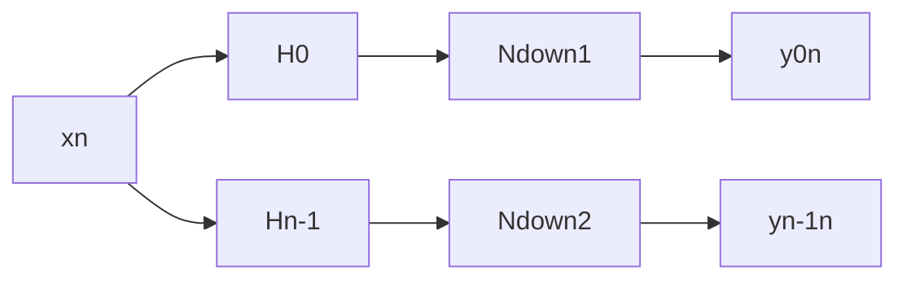
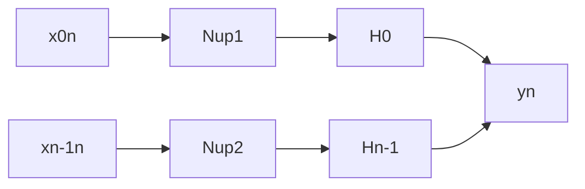
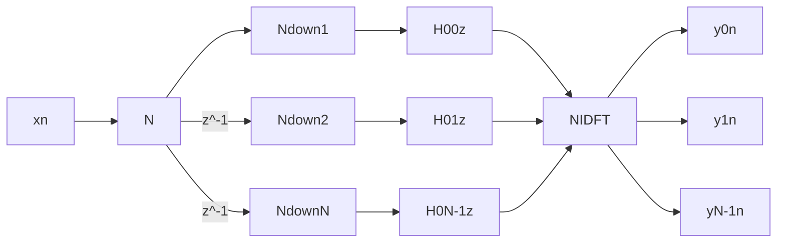

### 3.4.2 CIC滤波器

* CIC抽取D和CIC内插I

### 3.4.3 半带滤波器

* H(z) + H(-z) = 1 称为半带滤波器Hbb(z)  
  * H(fd) + H(fd+1/2) = 1
  * 频谱特点：关于fd=1/2对称，平移1/2互补;
  Hd(1/4)=0.5
  * 好处：h[n]特点——h[0]=1/2;h[even]=0;h[odd]=任意——一半为0，可以减少一半的计算量
* 半带抽取器和半带内插器
  * -->Hbb(z)-->I-->: $H_{bb}(z)=\sum h_{bb}(n)z^{-n}=z^{-1}H_{1}(z^2)+H_{0}(z^2)$多相分解
  * ```mermaid
    graph LR;
    xn-->Idown1;
    Idown1-->H0;
    xn-->|z^-1|Idown2;
    Idown2-->H1;
    H0-->out;
    H1-->out;
    ```
  * ```mermaid
    graph LR;
    in-->Iup;
    Iup-->Hbb;
    Hbb-->out;
    ```

  * 等效
    ```mermaid
    graph LR;
    xn-->H0;
    H0-->Iup1;
    xn-->H1;
    H1-->Iup2;
    Iup1-->sum;
    Iup2-->|Z^-1|sum;
    sum-->out
    ```
## 3.5 数字滤波器组

分析滤波器组：每个滤波器是相同频响的平移

$$H_0(e^{j\omega})\\
H_k(e^{j\omega})=H_0(e^{j(\omega-2\pi k/N)})
$$

综合滤波器组：

### 3.5.1 DFT矩阵表达
$$
X=(X[0]...X[N-1])^T\\
x=(x[0]...x[N-1])^T\\
X = \left[
    \begin{matrix}
    1 & 1 & ... & 1\\

    \end{matrix}
    \right]x
$$

### 3.5.2 滤波器组的多相实现

* 分析滤波器组的多相实现

可知$H_k(e^{j\omega})=H_0(z{W_n^k})$

将$H_0(z)$进行N相分解：

$$H_0(z)=[1,1,1...1]
    \left[
    \begin{matrix}
    H_0(z^N)\\
    z^-1H_1(z^N)\\
    \vdots\\
    z^{-N-1}H_{N-1}(z^N)   
    \end{matrix}
    \right]
$$

$$H_k(z)=[1,W_N^{-k}...W_N^{-(N-1)k}]
    \left[
    \begin{matrix}
    H_{0,0}(z^N)\\
    z^-1H_{0,1}(z^N)\\
    \vdots\\
    z^{-N-1}H_{0,N-1}(z^N)   
    \end{matrix}
    \right]
$$



综合滤波器组的多相实现